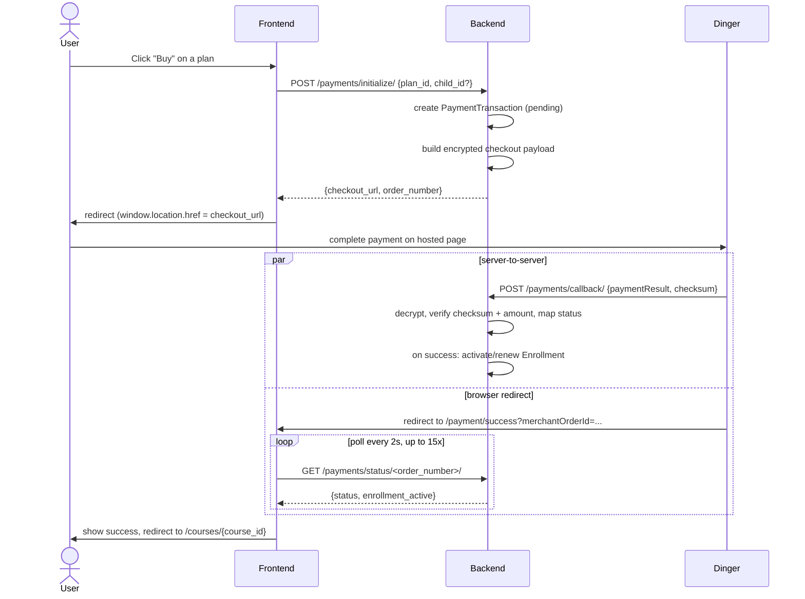

# Buying a Subscription — `payments/initialize/`

How a user purchases a subscription plan via `apps/billing`
(`api/billing/` mounted in [`lms/urls.py`](../backend/lms/urls.py)). Payment
provider is **Dinger** (Myanmar payment gateway).

## Endpoint

**`POST /api/billing/payments/initialize/`** — `InitializePaymentApiView`
(requires authentication)

Request body:
```json
{
  "plan_id": 2
}
```

A parent buying access for a linked child instead of themselves adds
`child_id`:
```json
{
  "plan_id": 2,
  "child_id": 57
}
```

Success response (`200`):
```json
{
  "checkout_url": "https://checkout.dinger.com/pay?payload=...&hashValue=...",
  "order_number": "MM-3F9A2B7C1D4E"
}
```

Error responses:
- `400` — missing `plan_id`, or a payment is already in progress:
  `{"success": false, "message": "plan_id is required."}`
- `404` — plan or child not found:
  `{"success": false, "message": "Subscription plan not found."}`
- `500` — checkout URL construction failed (e.g. gateway misconfiguration):
  `{"success": false, "message": "..."}`

## What happens (`payments.initialize_payment()`, in [`payments.py`](../backend/apps/billing/payments.py))

1. Resolves the target user: the logged-in user by default, or a linked
   child if `child_id` is given (rejected unless `child.parent_id` matches
   the requester).
2. Looks up the plan — must be `is_active=True`.
3. Checks for an existing `pending` transaction for that user+course:
   - if created within the last minute, blocks with "A payment is already in
     progress."
   - otherwise auto-marks it `failed` ("Payment session expired") and
     proceeds.
4. Creates a `PaymentTransaction` row (`order_number` = `MM-<12 hex>`,
   `status="pending"`).
5. Calls `gateways.build_checkout_url()` to build the Dinger redirect URL:
   - Builds a payload (customer info, amount, order number, item name).
   - RSA-encrypts it with `DINGER_ENCRYPTION_KEY`.
   - HMAC-SHA256-signs the plaintext JSON with `DINGER_SECRET_KEY`.
   - Returns `{DINGER_BASE_URL}?payload=...&hashValue=...`.
   - On any failure here, the transaction is marked `failed` and the error
     is re-raised (surfaced as the `500` above).
6. Returns `{checkout_url, order_number}` to the client, which redirects the
   user to `checkout_url` to complete payment on Dinger's hosted page.

## End-to-end flow: user clicks "Buy"

1. User is on the course page and clicks **Subscribe**, landing on
   `/courses/[id]/subscribe` (`frontend/src/app/[locale]/(website)/courses/[id]/subscribe/page.js`).
2. They pick a plan and click **Buy**. `handleSubscribe(planId)` calls the
   `useCoursePurchaseStore.initializePayment(planId, childId?)` action, which
   calls `paymentService.initializePayment` →
   **`POST /api/billing/payments/initialize/`** (the endpoint documented
   above).
3. Backend creates the `pending` `PaymentTransaction` and returns
   `{checkout_url, order_number}`.
4. Frontend does a **full-page redirect**: `window.location.href = checkout_url`
   — the user leaves the app and lands on Dinger's hosted payment page.
5. User completes (or cancels) payment on Dinger's page.
6. Two things happen from here, independently and roughly in parallel:
   - **Server-to-server:** Dinger calls
     **`POST /api/billing/payments/callback/`** directly on the backend with
     the encrypted result. The backend decrypts it, verifies the checksum and
     amount, and — on success — activates (or renews) the user's
     `Enrollment`. This is the step that actually grants access; it does not
     involve the browser at all.
   - **Browser redirect:** Dinger redirects the user's browser back to the
     app's `/payment/success` page (with the order number in the query
     string).
7. `/payment/success` polls **`GET /api/billing/payments/status/<order_number>/`**
   every 2 seconds, up to 15 attempts, waiting for the callback (step 6) to
   have landed:
   - `status === "success"` → shows a success message, then redirects to
     `/courses/{course_id}` after ~1.5s.
   - `status === "failed"` / `"cancelled"`, or polling exhausts its attempts
     → redirects to `/payment/failed` (shows the reason, with a link back to
     `/courses/[id]/subscribe` to retry).


